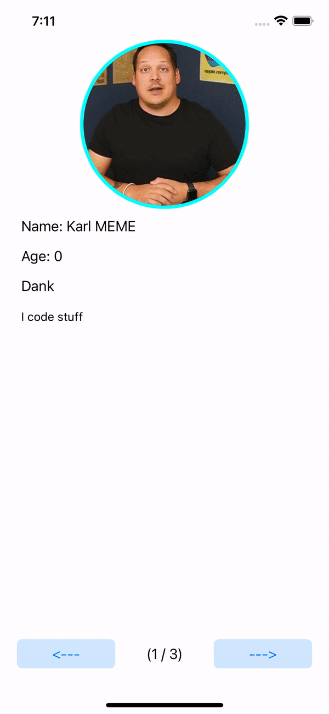

# About Me
---
In this project, you will use your knowledge of Swift to build an app that display either your cohort mates or a few famous friends. We will use everything you’ve learned so far to complete this!

Students who complete this project independently or as a pairing will showcase their understanding of the the following principles:

Basic Storyboard constraints
Creating Custom `class` objects
Constants, Variables, and basic Data Types
UIImageview
Collections
Functions
Control Flow
IBActions && IBOutlets

## Completed project


## Design the Storyboard

Too create our storyboard will need to flex our skills with Interface builder, constraints, and adding attributes. View the video of the completed project to get an idea of what the storyboard will look like. Okay, let’s get started!

### Starting from the top down
Let’s begin our interface design by adding a `UIImageview` to the canvas. 
* Access the object library via the + on the top right side. Drag a `Image View` object to the canvas. 
* Set the following constraints to the `Image View`
	* Align the center
	* Align the top to the safe area
	* Set the hight to 200
	* Add an aspect Ratio of 1:1

Now let’s add the `UILabel`s that will display the text of our application.

* Drag three `Label` objects from the `Object Library` and drop them onto the canvas
* Embed the three `Label` into a `Stack View`
* Via the `Attributes Inspector` Give each label basic text that describes what it will hold eventually
	* (Name)
	* (Age)
	* (Occupation)
* Via the `Attributes Inspector` of the `Stack View` adjust the following values
	* Set the alignment to Leading
	* Set the Distribution to Fill
	* Set the spacing to 15
* Lock in your `Stack View` with the following constraints
	* Align `Leading` and `Trailing` to 25 points to the `Safe Area`
	* Align the `Top`space to 10 points to the `Safe Area`

Now we need to add a `UITextView` to display the largest of our text.

* Drag a `Text View` view element from the `Object Library` and drop it onto the canvas under the `Stack View` which holds our `Label`s
* Set the following constraints
	* Align `Leading` and `Trailing` to 20 points to the `Safe Area`
	* Align the `Top`space to 10 points to the `Safe Area`
GGEZ, right?

Now all we have left to do is create our Back Button, Forward Button, and a label to display what user we are on.

* Drag 2 `UIButton` Objects from the library and place onto the canvas.
* Drag 1 `Label` Object to from the library and place it onto the canvas
* Embed all three  of these ^ view elements into one `Stack View`
	* Ensure the Label is the center object
* Via the `Attributes Inspector` of the `Stack View` adjust the following values
	* Set the axis to the appropriate direction for the look we desire
	* Set the alignment to `Fill` 
	* Set the Distribution to `Fill Equally`
	* Set the spacing to 0
* Give one `button` the `title` of `<---`
* Give the other `button` the `title` of `--->`
* Give the label a default title that represents what it will eventually display
	* (1/9)
* The `Stack View` should have the following constraints which should lock all your objects into their beautiful and final positions
	* Align the Trailing, Leading, Top, and Bottom to 20 points to the `Safe Area`
	
Great work! Now feels like a great time to create all the IBActions and IBOutlets you will need. Go ahead and rock that out.

---
## Model
 In this section we will create a person model with the properties we wish to display. To do this, we need to first create a new `.Swfit` file for us to use. File -> New -> File -> Swift File. Please give this file the name `Person`

On this new file define a `class` with the following properties and a `member-wise initializer`. Be sure to use the appropriate `Data Types` for each `property`
* name          
* age           
* occupation    
* description   
* profilePicture

## Data File
To make things easer on us in the long run we will create a `Data` file that will hold our `collection` of `Person` objects. We will then reference back to this `collection` in our `View Controller` to display the correct information. To do this, we need to first create a new `.Swfit` file for us to use. File -> New -> File -> Swift File. Please give this file the name `Data`. 

On our new `Data.Swift` file, please define a `struct` with the name `Data`. The next section of instruction will be written with the scope of the `Data` struct.

* Define a new constant named `people` and set it to be of value an `Array` of `Person` objects. Assign this to an empty `Array Literal`
* Within the `[ ]`  initialize as many `Person` objects as you aim to display
	* No less than three
* Set the `people` array to be `static`
	* This allows us to access the values outside this file

This section may be a bit confusing so below showcases an example of how it should 

``` swift
static let people: [Person] = [Person(name: "Karl MEME", birthDay:"2022/01/10", occupation: "Dank", description: "I code stuff", profilePicture:  imageLiteral(resourceName: "karl")), .....
```

Don’t forget to add images to your `Assets` folder!

## View Controller
Here is where the magic happens! On our `View Controller` we will write the code to display all our data to our users! At this time you should have all your `IBOutlets` and `IBActions` already created.

One of the first challenges to overcome is knowing what `Person` object we are displaying so we know what the previous along with what the next object to be displayed will be. To accomplish this we will create a local property called Index.

* Create a new variable named `index` with a default value of `0`

Great work! Now lets start working on a helper function to display our data!

* Define a function with the name `updateUI` with no parameters.
* Within the body of this function complete the following tasks
	* Create a constant named `person` and assign the value of what ever `Person` objects index matches the current value of our `index` property
```swift
let person = Data.people[index]
```
* Set the `text` property of your `nameLabel` to the `name` of the `person` object. Use string interpolation to make this read even better.
	* “Name: Enter code Here”
* Set the `text` property of your `occupationLabel` to the `occupation` of the `person` object. 
* Set the `text` property of your `descriptionTextView` to the `description` of the `person` object. 
* Set the `image` property of your `profileImageView` to the `profile` of the `person` object. 
* Set the `text` property of your `currentPlaceLabel`  to the current index. 
	* For this to work you’ll need to use string interpolation to show the current index and the overall count of `people` objects.
		* Hint - arrays index at 0

To display the `age` beautifully we will need a few things. We will need a helper function that will do all the math for us to know how old the `person` is. Then we need to convert that `Date` to a string to properly display it.

Let’s start with the helper function to mathematically determine the `age` of a person.

* define a new function with the name `myAge` with one parameter; `birthday` which will be of type `Date`. This function should return to us an `Int`
* Create a new constant named `age` and assign it to the result of the `dateComponents( [.year], from start:   , to end:    )` method.
	* `from: ` should be the `birthday` that was passed into the `myAge` function
	* `to: ` should be a `Date`  initialized to the current date and time

Return the `age.year` . This will be optional so use `nil coalescing` to return `0` if nil.

Now navigate back to the `updateUI` method. The remaining instructions will be written within this methods scope.

We are so close to being able to display the age. All we have left to so is use a `DateFormatter` to take our date and display it as a `String`. To accomplish this we will need to..

* Define a new constant named `formatter` and align it to an initialized `DateFormatter` class
* Using dot notation access the `dateFormat` property of the `formatter` and assign the value of `”yyyy/MM/dd”`
* Set the `text` property of your `ageLabel`  to the a `string literal` that reads `”Age: \(myAge(birthday: formatter.date(from: person.birthDay)!))”`
* Call your `updateUI` function in the `viewDidLoad`
* Set the `contentMode` of your `ImageVIew` to `.scaleAspectFit`

###  Build and run your project! Let’s see how it works.

---

At this point the app should build, run, and display the first `person` in your `people` array. We still need to add in the functionality of our buttons cycling the objects. Lets do that now

### Forward Button
For the forward button to work we need to know if we have reached the end of the `people` array. 

* Write an `if-statement` that check if `index` is less than the count of your people array
	* Arrays index at 0 😎
* if the `index` is indeed less than the count of our `people` array
	* Add and assign `1` to the `index`
	* update the ui

### Back Button
* Write an `if-statement` that check if `index` is  greater than `0`
* If the `index` Is indeed greater than `0`
	* decrease the `index` by `1`
	* update the UI

###  Build and run your project! Let’s see how it works.
 The app should now build and function properly! Nice work!!!

---
# Stretch goals
Try and get your `image view` to look like the one in the demonstration recording

---
